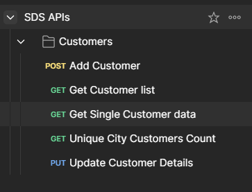

---

# Customer Management Dashboard

A full-stack MERN application featuring a REST API and a frontend Dashboard to manage and display customer information. The project utilizes Node.js, React, Tailwind CSS, Sequelize ORM, and MySQL.

## Table of Contents

- [Features](#features)
- [Tech Stack](#tech-stack)
- [Setup](#setup)
- [Usage](#usage)
- [API Endpoints](#api-endpoints)
- [Additional Features](#additional-features)

## Features

### Backend:

1. **Database Setup**:

   - Ensure that Mysql is Installed
   - Sample customer data:
     ```json
     {
       "id": 1,
       "first_name": "Aman",
       "last_name": "Gupta",
       "city": "Ahmedabad",
       "company": "SublimeDataSystems"
     }
     ```
2. **REST APIs**:

   https://documenter.getpostman.com/view/28557972/2sAXqp7iMD


   

### Frontend:

1. **Dashboard**:
   - Displays a list of customers with search and pagination features.
   - Clicking on a customer shows detailed information on a new route with a "Back" button.
   - Includes a button to view the list of cities and the number of customers from each city with a "Back" button.
2. **Additional Features**:
   - Edit customer details with file upload.
   - Upload functionality is supported on the backend, storing the uploaded file in Cloudinary.

## Tech Stack

- **Frontend**: Vite, React.js, Tailwind CSS
- **Backend**: Node.js, Sequelize ORM, MySQL
- **Database**: MySQL
- **Additional:** Cloudinary for image storage

## Setup

### Prerequisites

- Node.js
- npm
- MySQL

### Clone the Repository

```bash
git clone https://github.com/rythm01/SDS-Assessment
cd SDS-Assessment
```

### Backend Setup

1. **Database Setup**:

   - Import `sampledata.sql` into MySQL:
     ```bash
     mysql -u [username] -p sdsdb < sampledata.sql
     ```
   - Alternatively, create a database as specified in the `.env` file.
2. **Install Dependencies and Start Server**:

   ```bash
   cd server
   npm install
   npm start
   ```

### Frontend Setup

1. **Install Dependencies and Run Frontend**:
   ```bash
   cd client
   npm install
   npm run dev
   ```

## Usage

- Access the frontend dashboard at `http://localhost:5173` (or as provided by Vite).
- Use the REST APIs to manage customer data.

## API Endpoints

1. **List Customers**: `/api/customer/listCustomers?page=1&searchTerm=Ridham&limit=20`

   - Supports search by `first_name`, `last_name`, and `city`.
   - Supports pagination.
2. **Single Customer**: `/api/customer/getSingleCustomer/`

   - Retrieves a single customer by `id`.
3. **List Cities**: `/api/customer/uniqueCities`

   - Lists all unique cities with the count of customers.
4. **Edit Customer**: `/api/customer/:id`

   - Updates customer details with file upload support.

## Additional Features

- Edit customer details via a modal with file upload support.
- Enhanced search and pagination for an improved user experience.
- Tooltip Content

---
